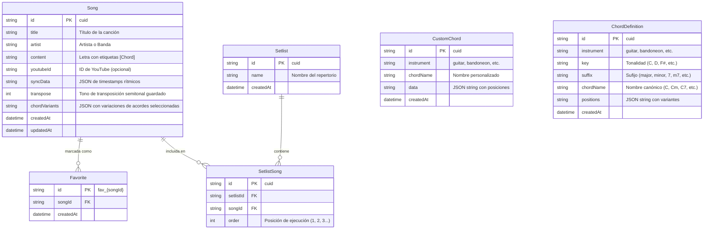

# Guía de Desarrollo y Onboarding para Agentes de IA: SongBook

Esta guía contiene la información técnica, arquitectónica y de diseño de datos sobre **SongBook** para que cualquier nuevo agente de IA pueda entender el proyecto, interactuar con su base de datos y continuar con su desarrollo.

---

## 1. Visión General del Proyecto

**SongBook** es un cancionero digital interactivo (*"The Musician's Notebook"*) diseñado para músicos, compositores y bandas. Su interfaz recrea la experiencia analógica y táctil de un **cuaderno encuadernado en espiral metálico**, hojas de papel texturadas y recortes rasgados flotantes, combinándolo con la potencia de:
- Visualización de acordes interactivos con sonido real (**Tone.js**).
- Sincronización con videos de YouTube en notas rasgadas arrastrables (**Floating Paper Scrap**).
- Gestión avanzada de repertorios (**Setlists**) y canciones favoritas (**⭐ Favoritas**).
- Modelo de monetización **Freemium** (Planes *Free* y *Pro/Premium* con límites y anuncios).
- Soporte multilingüe (**i18n** Español/Inglés).

---

## 2. Arquitectura de Archivos y Componentes Clave

### Frontend (`src/`)

```
src/
├── App.jsx                        # Entrada principal con LanguageProvider y AuthProvider
├── main.jsx                       # Montaje de React 18 en el DOM
├── index.css                      # Estilos globales, texturas de papel (.paper-texture, .desk-surface)
├── config.js                      # Configuración de URLs de API
├── context/
│   ├── AuthContext.jsx            # Autenticación, roles (FREE/PREMIUM), límites y modal de upgrade
│   └── LanguageContext.jsx        # Contexto i18n con detección de idioma del navegador
├── i18n/
│   └── translations.js            # Diccionario de traducciones (Español / Inglés)
├── data/
│   └── sampleSongs.js             # Canciones de muestra precargadas y acordes estándar
├── services/
│   └── scraperApi.js              # Cliente para scraping (Ultimate Guitar y Cifra Club)
├── utils/
│   ├── audioPlayer.js             # Motor de síntesis y rasgueo de acordes con Tone.js
│   ├── cache.js                   # Caché en memoria para peticiones
│   └── music.js                   # Transposición de notas, acordes y parsing de texto
└── components/
    ├── notebook/
    │   ├── NotebookSpread.jsx     # CONTROLLER PRINCIPAL: Doble página con animación 3D (page-flip)
    │   ├── SetlistsPanel.jsx      # PÁGINA IZQUIERDA: Listado y contenido detallado de Setlists
    │   ├── FavoritesLibraryPanel.jsx # PÁGINA DERECHA: Canciones favoritas, catálogo y buscador
    │   ├── NotebookCover.jsx      # Tapa de cuero y bocetos cuando no hay sesión iniciada
    │   ├── NotebookTabs.jsx       # Pestañas laterales de índice
    │   ├── SpiralRings.jsx        # Anillas metálicas de espiral central
    │   ├── LoginForm.jsx          # Formulario de inicio de sesión
    │   ├── RegisterForm.jsx       # Formulario de registro de músico
    │   └── GuestPrompt.jsx        # Acceso directo en Modo Libre
    ├── song/
    │   ├── SongSheetView.jsx      # Vista de atril: 2 páginas con acordes, transposición y autoscroll
    │   └── FloatingVideoPaper.jsx # Reproductor YouTube sobre papel rasgado arrastrable
    ├── guitar/
    │   └── GuitarChordDiagram.jsx # Diagrama SVG interactivo de acordes para guitarra
    ├── monetization/
    │   ├── UpgradeModal.jsx       # Modal de ventas y suscripción a SongBook Pro
    │   └── AdBanner.jsx           # Banner publicitario para usuarios del plan Free
    └── search/
        ├── SongSearchRebuild.jsx  # Modal de búsqueda y agregación de canciones online
        └── SongScraperModal.jsx   # Importador de acordes desde URLs
```

---

## 3. Estructura y Esquema de la Base de Datos (Prisma + SQLite)

La base de datos relacional se encuentra en `server/prisma/dev.db` y es gestionada con **Prisma ORM**.

### Diagrama Entidad-Relación



---

## 4. Endpoints de la API Backend

### Persistencia (`/api/persistence/`)

| Método | Endpoint | Descripción |
| :--- | :--- | :--- |
| `GET` | `/api/persistence/songs` | Obtiene todas las canciones guardadas con su tono y variaciones. |
| `POST` | `/api/persistence/songs` | Guarda o actualiza una canción (`upsert`), incluyendo `transpose` y `chordVariants`. |
| `PATCH`| `/api/persistence/songs/preferences` | Actualiza la transposición y variaciones de acordes de una canción. |
| `GET` | `/api/persistence/favorites` | Obtiene la lista de canciones marcadas como favoritas. |
| `POST` | `/api/persistence/favorites` | Marca una canción como favorita guardando sus preferencias. |
| `DELETE`| `/api/persistence/favorites/:songId` | Desmarca una canción de favoritas. |
| `GET` | `/api/persistence/setlists` | Obtiene todos los setlists con sus canciones ordenadas por `order`. |
| `POST` | `/api/persistence/setlists` | Crea un nuevo setlist por nombre. |
| `POST` | `/api/persistence/setlists/songs` | Agrega una canción a un setlist preservando tono y digitaciones. |
| `DELETE`| `/api/persistence/setlists/:name/songs/:songId` | Quita una canción específica de un setlist. |
| `DELETE`| `/api/persistence/setlists/:name` | Elimina un setlist completo y sus relaciones. |
| `GET` | `/api/persistence/chords/lookup?name=...` | Busca la definición de un acorde (trastes, cejillas, dedos) en SQLite. |
| `POST` | `/api/persistence/chords` | Guarda una variante personalizada de acorde para un usuario. |

### Streaming de Audio & Transcripción (`/api/audio/` y `/api/songs/`)

| Método | Endpoint | Descripción |
| :--- | :--- | :--- |
| `GET` | `/api/audio/stream?youtubeId=...` | Streaming de audio en alta calidad con soporte `206 Partial Content` y caché en disco (`.webm`) para pitch shifting. |
| `POST` | `/api/songs/transcribe/youtube` | Transcripción de acordes y BeatGrid usando Chordify o IA local. |
| `GET` | `/api/songs/content?url=...&source=...` | Scraping de canciones desde Ultimate Guitar y Cifra Club. |

---

## 5. Ingesta Masiva del Diccionario de Acordes

El proyecto cuenta con un script de ingesta en `server/prisma/seed-chords.js`:
- Lee recursivamente el catálogo JSON de acordes desde `public/chords-db/` (o desde `chordbook`).
- Normaliza nombres de acordes a su nomenclatura musical estándar (`key + suffix`).
- Ejecuta `createMany` en lotes de 250 registros con `skipDuplicates: true` para popular la tabla `ChordDefinition`.

Para ejecutar la migración y carga de acordes:
```bash
cd server
npx prisma db push
node prisma/seed-chords.js
```

---

## 6. Mecanismos y Lógicas Clave

### A. Pitch Shifting y Streaming de Audio (Tone.js + Pro Tier)
- Los usuarios **Pro/Premium** pueden transponer cualquier canción con video de YouTube y escuchar el audio en el tono relativo exacto (`usePitchShiftAudio.js` con `Tone.PitchShift`).
- El backend (`server/routes/audio.js`) utiliza `youtube-dl-exec` para descargar y transmitir el audio optimizado en streaming HTTP continuo con cabeceras `Range`.
- El reproductor original de YouTube se silencia automáticamente (`isMuted={isPitchShiftActive}`) mientras el audio transpuesto suena en perfecta sincronía.
- Sincronización continua de estado (heartbeat cada 120ms) que detiene y reanuda el audio inmediatamente cuando el usuario pausa el video.

### B. Persistencia Dinámica de Tono y Variaciones de Acordes
- Cada canción almacena su último valor de transposición (`transpose`) y un mapa JSON de variaciones elegidas (`chordVariants`, ej: `{"C": 1, "G": 0}`).
- Estos datos se sincronizan bidireccionalmente entre `localStorage` y la base de datos SQLite (`/api/persistence/songs/preferences`).
- Al abrir una canción desde la biblioteca, repertorios (Setlists) o Stage Mode, se carga automáticamente en la tonalidad y con las digitaciones guardadas por el músico.

### C. Panel Visual de Progreso por Etapas en el Buscador
- `SongSearchRebuild.jsx` cuenta con un modal de progreso animado con Framer Motion que muestra el estado de la importación paso a paso:
  1. Conexión con la fuente / YouTube.
  2. Descarga de acordes y cuadrícula rítmica (BeatGrid).
### D. Scraping de Chordify & Evasión de Cloudflare (Puppeteer Stealth)
- **Detección de Chrome Nativo**: `server/config/puppeteer.js` detecta automáticamente la instalación nativa de Google Chrome (`C:\Program Files (x86)\Google\Chrome\Application\chrome.exe` o `C:\Program Files\Google\Chrome\Application\chrome.exe`).
- **Flags Antidetección**: Se eliminaron flags que delatan entornos headless (`--disable-gpu`, `--no-zygote`) y se utiliza `puppeteer-extra-plugin-stealth` con `--disable-blink-features=AutomationControlled` y `--window-size=1280,800`.
- **Extracción Inmediata**: La llamada `/api/songs/transcribe/youtube` extrae BPM, tonalidad y cuadrícula de compases rítmicos en <10s sin descargar audio ni bloquear peticiones.

### E. Silencios Musicales en Intro y Estructura Rítmica
- Los compases vacíos iniciales se interpretan como compases de silencio (`𝄾 2T` / `𝄾 4T`) y se asignan a la sección `Intro`.
- El primer acorde con letra activa la `Estrofa 1`.
- Los caracteres espurios (`[']`, `['´]`, `’`) son filtrados en `SongLyricsRenderer.jsx` mediante `IGNORED_CHORD_REGEX` para preservar únicamente acordes reales y símbolos de silencios (`𝄾`, `𝄽`).

---

## 7. Reglas de Negocio & Buenas Prácticas

1. **Persistencia Híbrida (Resiliencia Offline)**:
   - El estado del frontend sincroniza primero con la base de datos SQLite y mantiene un espejo de respaldo en `localStorage` (`songbook_user_songs`, `songbook_setlists`).
2. **Niveles de Usuario (AuthContext)**:
   - **FREE**: Hasta 5 canciones, 2 setlists, muestra anuncios con `AdBanner.jsx`. La transposición transpone los acordes visualmente y notifica que el cambio de tono en el audio es una función Pro.
   - **PREMIUM**: Canciones y setlists ilimitados, sin anuncios, exportación, pitch shifting de audio en tiempo real y sincronización total.
3. **Descarga de Audio Estrictamente On-Demand**:
   - **NUNCA** iniciar descargas de audio de YouTube ni tareas pesadas de ML en el proceso de búsqueda o scraping.
   - La descarga solo se dispara cuando el usuario interactúa activamente con el control de transposición (`transpose !== 0`).
4. **Parámetros Críticos para yt-dlp (Evasión 403 YouTube)**:
   - En `server/routes/audio.js`, `yt-dlp` debe ejecutarse siempre con `--extractor-args "youtube:player_client=android,web"` y `-f ba/b` para evitar los bloqueos `403 Forbidden` de YouTube.
5. **Manejo de Web Audio & Tone.js**:
   - Todo cambio de tono (`+` / `-`) ejecuta `Tone.start()` y `Tone.context.resume()` dentro del evento del usuario para cumplir con las políticas de autoplay de los navegadores.
6. **Estética Visual Analógica**:
   - Mantener las clases de textura de papel (`paper-texture`), fondos de escritorio de madera (`desk-surface`), sombras suaves interiores (`shadow-[inset_..._rgba(0,0,0,0.06)]`) y botones con estilo vintage moderno (tonos `stone` y `amber`).
7. **Manipulación de DOM y Animaciones**:
   - Usar `Framer Motion` con `perspective` para transiciones de páginas.
   - No usar `scrollIntoView` global; utilizar scrolls locales dentro de los contenedores de páginas.

